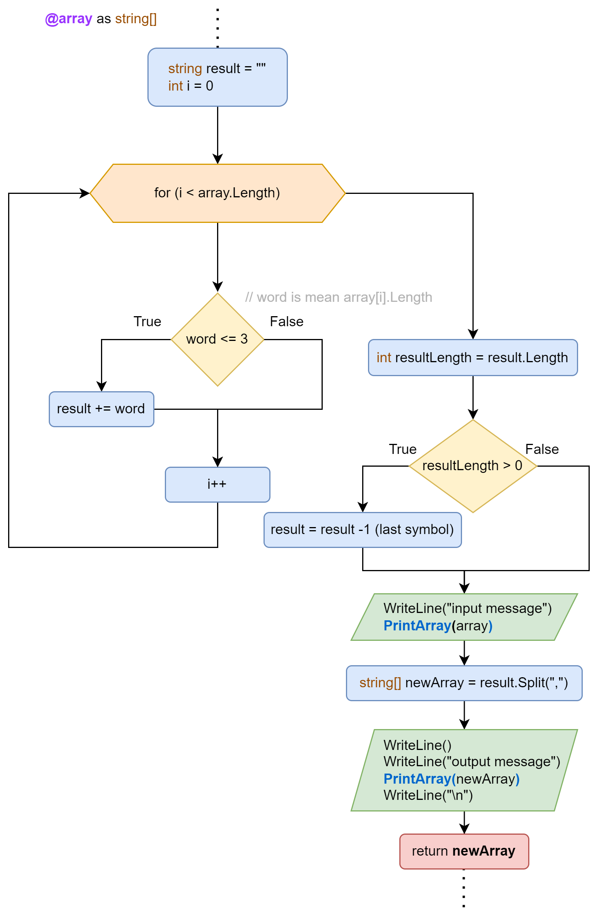

# FINAL WORK (DEVELOPER)

GeekBrains, winter 2023

> ### This program will help you in a strange situation.. Imagine, that you have an array with strings like: ["Russia", "Indonesia", "Denmark"]. It'll check each item. If the value is less or equal three - fine. In this situation you get an empty array as output. To get other output values type something short!:D

## Info

- You can find source code of this project in `gb-001-finalwork`


- This project uses [gitignore templates](https://github.com/iksergey/gitignore) (C#)

## Methods

Signature | Сomment 
---|---
`string[] GetArray()` | Provides user-input func
`void PrintRowNumber(int rowNumber)` | Helps to display each row of arrays separately
`void PrintArray(string[] array)` | Just shows to a user an array 
`...` | main
```C#
string[] GetNewArrayWithItemsLengthLessOrEqualThree(string[] array)
```



## Usage

- Clone main repo with another solutions from courses:
`https://github.com/mastervlados/csharp.git`

- Go to the `../CSharp/001/finalwork` folder

- Open file `Program.cs` and call main func correcly:

Just call all necessary methods:
```C#
// If you would like to type words by yourself
...

GetNewArrayWithItemsLengthLessOrEqualThree(GetArray());
```
Other way:
```C#
// If you already have an array with string items
...

string[] array = new string[4] { "hell", "2", "done", ":D" };
GetNewArrayWithItemsLengthLessOrEqualThree(array);
```

#### Best regards, Vladislav
